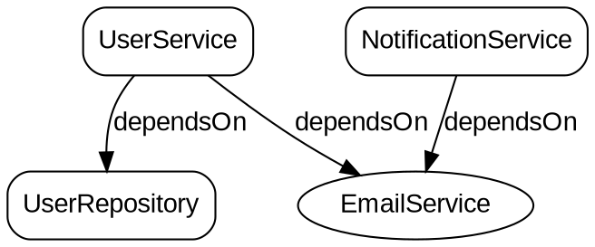

[](https://github.com/yasmramos/Veld/actions)
[](LICENSE)
[](https://openjdk.java.net/)
[](https://maven.apache.org/)
[](https://deepwiki.com/yasmramos/veld)
[](https://github.com/yasmramos/Veld/actions)
[](https://codecov.io/gh/yasmramos/Veld)
[](https://github.com/yasmramos/Veld/releases)
[](https://github.com/yasmramos/Veld/commits/develop)
[](https://github.com/yasmramos/Veld/issues)
[](https://github.com/yasmramos/Veld/network/members)
[](https://github.com/yasmramos/Veld/stargazers)
[](https://github.com/yasmramos/Veld/graphs/contributors)

# Veld Framework

**Ultra-fast Dependency Injection for Java - Zero Reflection, Pure Code Generation**

Veld is a **compile-time Dependency Injection framework** that generates pure java code. Zero reflection at runtime means **maximum performance** - up to 100x faster than Spring for dependency resolution.

## Latest Updates (v1.0.3)

### Enhanced Test Coverage
- **216 tests now passing** with comprehensive coverage across all modules
- New test suites for DependencyGraph, DotExporter, DependencyNode, and ScopeType
- Improved component factory and event bus testing
- All edge cases and graph visualization features thoroughly validated

### Dependency Graph Visualization
- **New Graph Export Capabilities** - Export your dependency graph to standard formats
- **DOT Format Export** - Generate Graphviz-compatible DOT files for visualization
- **JSON Format Export** - Export dependency structure for tooling integration
- **Root/Leaf Node Analysis** - Identify root dependencies and leaf nodes automatically
- **Cycle Detection** - Detect circular dependencies at runtime

## Why Veld?

| Feature | Veld | Spring | Guice |
|---------|------|--------|-------|
| **Reflection at runtime** | None | Heavy | Moderate |
| **Startup time** | ~0.1ms | ~500ms+ | ~100ms |
| **Injection speed** | ~0.001ms | ~0.01ms | ~0.005ms |
| **Memory overhead** | Minimal | High | Moderate |
| **Configuration** | 1 plugin | Multiple configs | Modules |
| **Test Coverage** | 543 tests | Varies | Varies |

## Features

### Core DI

- **Zero Reflection** - All injection code generated at compile-time as code
- **Constructor Injection** - Preferred pattern, supports private constructors
- **Field Injection** - Works across packages via synthetic setters (bytecode weaving)
- **Method Injection** - Setter-based injection for optional dependencies
- **Interface Binding** - Inject by interface, resolved to implementation

### Scopes & Lifecycle

- **Singleton** - Single instance per application (default)
- **Prototype** - New instance on every request (`@Prototype`)
- **Lazy Initialization** - `@Lazy` for deferred creation
- **Lifecycle Callbacks** - `@PostConstruct` and `@PreDestroy` support
- **Conditional Registration** - `@ConditionalOnProperty`, `@ConditionalOnMissingBean`, `@ConditionalOnClass`

### Standards Support

- **JSR-330** - Full support for `javax.inject.*` annotations
- **Jakarta Inject** - Full support for `jakarta.inject.*` annotations
- **Mixed Usage** - Use both in the same project

### Dependency Graph Visualization

Veld provides powerful dependency graph visualization capabilities for analyzing your application's component relationships:

- **DependencyGraph** - Build and analyze component dependency graphs
- **Root/Leaf Detection** - Automatically identify root dependencies and leaf nodes
- **Cycle Detection** - Detect circular dependencies at runtime with detailed cycle information
- **Graph Export** - Export dependency graphs to standard formats for visualization

**Build Your Dependency Graph:**

```java
DependencyGraph graph = new DependencyGraph();

// Add nodes with their scopes
graph.addNode(new DependencyNode("com.example.UserService", "UserService", ScopeType.SINGLETON));
graph.addNode(new DependencyNode("com.example.UserRepository", "UserRepository", ScopeType.SINGLETON));
graph.addNode(new DependencyNode("com.example.EmailService", "EmailService", ScopeType.PROTOTYPE));
graph.addNode(new DependencyNode("com.example.NotificationService", "NotificationService", ScopeType.SINGLETON));

// Define dependencies between components
graph.addEdge("com.example.UserService", "com.example.UserRepository", "dependsOn");
graph.addEdge("com.example.UserService", "com.example.EmailService", "dependsOn");
graph.addEdge("com.example.NotificationService", "com.example.EmailService", "dependsOn");
```

**DOT Export (Graphviz):**

```java
DotExporter exporter = new DotExporter();
String dotOutput = exporter.exportToString(graph);

// Save to file
try (Writer writer = new FileWriter("dependencies.dot")) {
    exporter.export(graph, writer);
}

// Generate PNG image:
// dot -Tpng dependencies.dot -o dependencies.png
```

**Real DOT Output Example:**



**Visual Result:**

```
┌─────────────────────┐       ┌─────────────────────┐
│    UserService      │──────>│  UserRepository     │
│      (box)          │       │      (box)          │
└─────────────────────┘       └─────────────────────┘
           │
           │ dependsOn
           ▼
┌─────────────────────┐
│   EmailService      │◀──────┌─────────────────────┐
│     (oval)          │       │ NotificationService │
└─────────────────────┘       │      (box)          │
                              └─────────────────────┘
```

**JSON Export:**

```java
JsonExporter exporter = new JsonExporter();
String jsonOutput = exporter.exportToString(graph);

// Pretty print with metadata (default)
JsonExporter exporter = new JsonExporter(true, true);

// Compact format without metadata
JsonExporter exporter = new JsonExporter(false, false);
```

**Real JSON Output Example:**

```json
{
  "graph": {
    "directed": true,
    "nodes": [
      {
        "id": "com.example.UserService",
        "label": "UserService",
        "scope": "SINGLETON",
        "isPrimary": false,
        "profiles": [],
        "constructorDependencies": [],
        "fieldDependencies": ["com.example.UserRepository", "com.example.EmailService"],
        "methodDependencies": []
      },
      {
        "id": "com.example.UserRepository",
        "label": "UserRepository",
        "scope": "SINGLETON",
        "isPrimary": false,
        "profiles": [],
        "constructorDependencies": [],
        "fieldDependencies": [],
        "methodDependencies": []
      },
      {
        "id": "com.example.EmailService",
        "label": "EmailService",
        "scope": "PROTOTYPE",
        "isPrimary": false,
        "profiles": [],
        "constructorDependencies": [],
        "fieldDependencies": [],
        "methodDependencies": []
      },
      {
        "id": "com.example.NotificationService",
        "label": "NotificationService",
        "scope": "SINGLETON",
        "isPrimary": false,
        "profiles": [],
        "constructorDependencies": [],
        "fieldDependencies": ["com.example.EmailService"],
        "methodDependencies": []
      }
    ],
    "edges": [
      {
        "from": "com.example.UserService",
        "to": "com.example.UserRepository",
        "relationship": "dependsOn"
      },
      {
        "from": "com.example.UserService",
        "to": "com.example.EmailService",
        "relationship": "dependsOn"
      },
      {
        "from": "com.example.NotificationService",
        "to": "com.example.EmailService",
        "relationship": "dependsOn"
      }
    ]
  },
  "metadata": {
    "nodeCount": 4,
    "edgeCount": 3,
    "hasCycles": false,
    "cycleCount": 0,
    "rootNodes": ["com.example.NotificationService"],
    "leafNodes": ["com.example.UserRepository", "com.example.EmailService"]
  }
}
```

**Graph Analysis:**

```java
DependencyGraph graph = buildDependencyGraph();

// Get root nodes (not depended upon by anyone)
// These are entry points with no incoming dependencies
List<DependencyNode> roots = graph.getRootNodes();
System.out.println("Root nodes: " + roots);
// Output: Root nodes: [NotificationService]

// Get leaf nodes (no outgoing dependencies)
// These are terminal components with no further dependencies
List<DependencyNode> leaves = graph.getLeafNodes();
System.out.println("Leaf nodes: " + leaves);
// Output: Leaf nodes: [UserRepository, EmailService]

// Detect circular dependencies
List<List<String>> cycles = graph.findCycles();
if (!cycles.isEmpty()) {
    System.out.println("Circular dependencies found:");
    for (List<String> cycle : cycles) {
        System.out.println("  " + String.join(" -> ", cycle) + " -> (cycle)");
    }
} else {
    System.out.println("No circular dependencies detected");
}
// Output: No circular dependencies detected
```

**Cycle Detection Example:**

```java
// Create a graph with a circular dependency
DependencyGraph graph = new DependencyGraph();
graph.addNode(new DependencyNode("com.example.A", "A", ScopeType.SINGLETON));
graph.addNode(new DependencyNode("com.example.B", "B", ScopeType.SINGLETON));
graph.addNode(new DependencyNode("com.example.C", "C", ScopeType.SINGLETON));

graph.addEdge("com.example.A", "com.example.B", "dependsOn");
graph.addEdge("com.example.B", "com.example.C", "dependsOn");
graph.addEdge("com.example.C", "com.example.A", "dependsOn");  // Creates cycle!

List<List<String>> cycles = graph.findCycles();
// Output: [[com.example.A, com.example.B, com.example.C, com.example.A]]
```

### Advanced Features

- **Named Injection** - `@Named` qualifier for disambiguation
- **Value Injection** - `@Value` for configuration properties
- **Provider Support** - `Provider<T>` for lazy/multiple instances
- **AOP Support** - Aspect-oriented programming via `veld-aop` module
- **EventBus** - Event-driven component communication with `@Subscribe`
- **Profile Support** - `@Profile` for environment-specific beans
- **JPMS Compatible** - Full Java Module System support

### Resilience & Fault Tolerance (`veld-resilience`)

- **Retry** - `@Retry` automatic retry with exponential backoff
- **Rate Limiting** - `@RateLimiter` to control method call frequency
- **Circuit Breaker** - `@CircuitBreaker` prevents cascading failures
- **Bulkhead** - `@Bulkhead` limits concurrent executions
- **Timeout** - `@Timeout` cancels long-running operations

### Caching (`veld-cache`)

- **Cacheable** - `@Cacheable` caches method results
- **Cache Eviction** - `@CacheEvict` removes cache entries
- **Cache Put** - `@CachePut` updates cache without checking

### Validation (`veld-validation`)

- **Bean Validation** - `@Valid`, `@NotNull`, `@NotEmpty`, `@Size`
- **Numeric Constraints** - `@Min`, `@Max`
- **Pattern Matching** - `@Email`, `@Pattern`

### Security (`veld-security`)

- **Role-Based Access** - `@Secured`, `@RolesAllowed`
- **Method Security** - `@PreAuthorize`, `@PermitAll`, `@DenyAll`

### Metrics (`veld-metrics`)

- **Timing** - `@Timed` records execution duration
- **Counting** - `@Counted` tracks invocations
- **Gauges** - `@Gauge` exposes values as metrics

### Transactions (`veld-tx`)

- **Declarative TX** - `@Transactional` with propagation control
- **Rollback Rules** - Configure rollback for specific exceptions

**Ultra-fast Dependency Injection for Java - Zero Reflection, Pure Code Generation**

Veld is a compile-time Dependency Injection framework that generates pure Java code. Zero reflection at runtime means maximum performance - up to 100x faster than Spring for dependency resolution.

## Quick Start

### 1. Add Dependencies

**Maven:**
```xml
<dependency>
    <groupId>io.github.yasmramos</groupId>
    <artifactId>veld-runtime</artifactId>
    <version>1.0.3</version>
</dependency>
<dependency>
    <groupId>io.github.yasmramos</groupId>
    <artifactId>veld-annotations</artifactId>
    <version>1.0.3</version>
</dependency>
```

**Gradle:**
```gradle
implementation 'io.github.yasmramos:veld-runtime:1.0.3'
implementation 'io.github.yasmramos:veld-annotations:1.0.3'
```

### 2. Configure Maven Plugin

```xml
<build>
    <plugins>
        <plugin>
            <groupId>io.github.yasmramos</groupId>
            <artifactId>veld-maven-plugin</artifactId>
            <version>1.0.3</version>
        </plugin>
    </plugins>
</build>
```

### 3. Create Components

```java
import io.github.yasmramos.veld.annotation.Component;
import io.github.yasmramos.veld.annotation.Inject;

@Component
public class UserService {
    private final UserRepository repository;
    
    @Inject
    public UserService(UserRepository repository) {
        this.repository = repository;
    }
    
    public User getUser(Long id) {
        return repository.findById(id);
    }
}
```

### 4. Use Veld

```java
import io.github.yasmramos.veld.Veld;

public class Main {
    public static void main(String[] args) {
        UserService userService = Veld.get(UserService.class);
        User user = userService.getUser(1L);
    }
}
```

## Why Veld?

| Feature | Veld | Spring | Guice |
|---------|------|--------|-------|
| **Reflection at runtime** | None | Heavy | Moderate |
| **Startup time** | ~0.1ms | ~500ms+ | ~100ms |
| **Injection speed** | ~0.001ms | ~0.01ms | ~0.005ms |

## Performance Highlights

- **100x faster** than Spring for dependency resolution
- **3ns** average injection latency
- **0.003ms** startup time
- Zero runtime reflection overhead

## Documentation

| Topic | Location |
|-------|----------|
| Getting Started | [docs/getting-started.md](docs/getting-started.md) |
| Annotations Reference | [docs/annotations.md](docs/annotations.md) |
| Core Features | [docs/core-features.md](docs/core-features.md) |
| API Reference | [docs/api.md](docs/api.md) |
| AOP Guide | [docs/aop.md](docs/aop.md) |
| EventBus | [docs/eventbus.md](docs/eventbus.md) |
| Performance Benchmarks | [docs/benchmarks.md](docs/benchmarks.md) |
| Architecture | [docs/architecture.md](docs/architecture.md) |
| Examples | [docs/examples.md](docs/examples.md) |

## Modules

| Module | Description |
|--------|-------------|
| `veld-annotations` | Core annotations |
| `veld-runtime` | Runtime utilities |
| `veld-processor` | Annotation processor |
| `veld-weaver` | Bytecode weaving |
| `veld-maven-plugin` | Unified build plugin |
| `veld-aop` | Aspect-Oriented Programming |
| `veld-resilience` | Circuit Breaker, Retry, Rate Limiter |
| `veld-cache` | Caching support |
| `veld-validation` | Bean validation |
| `veld-security` | Method-level security |
| `veld-metrics` | Metrics collection |
| `veld-tx` | Transaction management |
| `veld-spring-boot-starter` | Spring Boot integration |

## Building from Source

```bash
git clone https://github.com/yasmramos/Veld.git
cd Veld
mvn clean install
```

## Links

- [GitHub](https://github.com/yasmramos/Veld)
- [Issues](https://github.com/yasmramos/Veld/issues)
- [Contributing](CONTRIBUTING.md)
- [License](LICENSE)

---

**Veld** - Dependency Injection at the speed of direct method calls.
