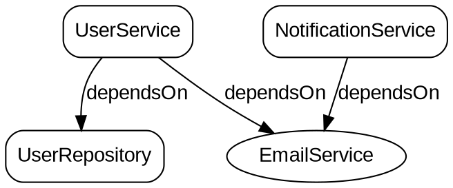

# Veld Framework

**Ultra-fast Dependency Injection for Java - Zero Reflection, Pure Code Generation**

[](https://github.com/yasmramos/Veld/actions)
[](LICENSE)
[](https://openjdk.java.net/)
[](https://maven.apache.org/)
[](https://deepwiki.com/yasmramos/veld)
[](https://github.com/yasmramos/Veld/actions)
[](https://github.com/yasmramos/Veld/actions)
[](https://github.com/yasmramos/Veld/releases)
[](https://github.com/yasmramos/Veld/commits/develop)
[](https://github.com/yasmramos/Veld/issues)
[](https://github.com/yasmramos/Veld/network/members)
[](https://github.com/yasmramos/Veld/stargazers)
[](https://github.com/yasmramos/Veld/graphs/contributors)

Veld is a **compile-time Dependency Injection framework** that generates pure code using ASM. Zero reflection at runtime means **maximum performance** - up to 100x faster than Spring for dependency resolution.

## Latest Updates (v1.0.3)

### Enhanced Test Coverage
- **543 tests now passing** with comprehensive coverage across all modules
- New test suites for DependencyGraph, DotExporter, DependencyNode, and LegacyScope
- Improved component factory and event bus testing
- All edge cases and graph visualization features thoroughly validated

### Dependency Graph Visualization
- **New Graph Export Capabilities** - Export your dependency graph to standard formats
- **DOT Format Export** - Generate Graphviz-compatible DOT files for visualization
- **JSON Format Export** - Export dependency structure for tooling integration
- **Root/Leaf Node Analysis** - Identify root dependencies and leaf nodes automatically
- **Cycle Detection** - Detect circular dependencies at runtime

## Why Veld?

| Feature | Veld | Spring | Guice |
|---------|------|--------|-------|
| **Reflection at runtime** | None | Heavy | Moderate |
| **Startup time** | ~0.1ms | ~500ms+ | ~100ms |
| **Injection speed** | ~0.001ms | ~0.01ms | ~0.005ms |
| **Memory overhead** | Minimal | High | Moderate |
| **Configuration** | 1 plugin | Multiple configs | Modules |
| **Test Coverage** | 543 tests | Varies | Varies |

## Features

### Core DI

- **Zero Reflection** - All injection code generated at compile-time as code
- **Constructor Injection** - Preferred pattern, supports private constructors
- **Field Injection** - Works across packages via synthetic setters (code weaving)
- **Method Injection** - Setter-based injection for optional dependencies
- **Interface Binding** - Inject by interface, resolved to implementation

### Scopes & Lifecycle

- **Singleton** - Single instance per application (default)
- **Prototype** - New instance on every request (`@Prototype`)
- **Lazy Initialization** - `@Lazy` for deferred creation
- **Lifecycle Callbacks** - `@PostConstruct` and `@PreDestroy` support
- **Conditional Registration** - `@ConditionalOnProperty`, `@ConditionalOnMissingBean`, `@ConditionalOnClass`

### Standards Support

- **JSR-330** - Full support for `javax.inject.*` annotations
- **Jakarta Inject** - Full support for `jakarta.inject.*` annotations
- **Mixed Usage** - Use both in the same project

### Dependency Graph Visualization

Veld provides powerful dependency graph visualization capabilities for analyzing your application's component relationships:

- **DependencyGraph** - Build and analyze component dependency graphs
- **Root/Leaf Detection** - Automatically identify root dependencies and leaf nodes
- **Cycle Detection** - Detect circular dependencies at runtime with detailed cycle information
- **Graph Export** - Export dependency graphs to standard formats for visualization

**Build Your Dependency Graph:**

```java
DependencyGraph graph = new DependencyGraph();

// Add nodes with their scopes
graph.addNode(new DependencyNode("com.example.UserService", "UserService", LegacyScope.SINGLETON));
graph.addNode(new DependencyNode("com.example.UserRepository", "UserRepository", LegacyScope.SINGLETON));
graph.addNode(new DependencyNode("com.example.EmailService", "EmailService", LegacyScope.PROTOTYPE));
graph.addNode(new DependencyNode("com.example.NotificationService", "NotificationService", LegacyScope.SINGLETON));

// Define dependencies between components
graph.addEdge("com.example.UserService", "com.example.UserRepository", "dependsOn");
graph.addEdge("com.example.UserService", "com.example.EmailService", "dependsOn");
graph.addEdge("com.example.NotificationService", "com.example.EmailService", "dependsOn");
```

**DOT Export (Graphviz):**

```java
DotExporter exporter = new DotExporter();
String dotOutput = exporter.exportToString(graph);

// Save to file
try (Writer writer = new FileWriter("dependencies.dot")) {
    exporter.export(graph, writer);
}

// Generate PNG image:
// dot -Tpng dependencies.dot -o dependencies.png
```

**Real DOT Output Example:**



**Visual Result:**

```
┌─────────────────────┐       ┌─────────────────────┐
│    UserService      │──────>│  UserRepository     │
│      (box)          │       │      (box)          │
└─────────────────────┘       └─────────────────────┘
           │
           │ dependsOn
           ▼
┌─────────────────────┐
│   EmailService      │◀──────┌─────────────────────┐
│     (oval)          │       │ NotificationService │
└─────────────────────┘       │      (box)          │
                              └─────────────────────┘
```

**JSON Export:**

```java
JsonExporter exporter = new JsonExporter();
String jsonOutput = exporter.exportToString(graph);

// Pretty print with metadata (default)
JsonExporter exporter = new JsonExporter(true, true);

// Compact format without metadata
JsonExporter exporter = new JsonExporter(false, false);
```

**Real JSON Output Example:**

```json
{
  "graph": {
    "directed": true,
    "nodes": [
      {
        "id": "com.example.UserService",
        "label": "UserService",
        "scope": "SINGLETON",
        "isPrimary": false,
        "profiles": [],
        "constructorDependencies": [],
        "fieldDependencies": ["com.example.UserRepository", "com.example.EmailService"],
        "methodDependencies": []
      },
      {
        "id": "com.example.UserRepository",
        "label": "UserRepository",
        "scope": "SINGLETON",
        "isPrimary": false,
        "profiles": [],
        "constructorDependencies": [],
        "fieldDependencies": [],
        "methodDependencies": []
      },
      {
        "id": "com.example.EmailService",
        "label": "EmailService",
        "scope": "PROTOTYPE",
        "isPrimary": false,
        "profiles": [],
        "constructorDependencies": [],
        "fieldDependencies": [],
        "methodDependencies": []
      },
      {
        "id": "com.example.NotificationService",
        "label": "NotificationService",
        "scope": "SINGLETON",
        "isPrimary": false,
        "profiles": [],
        "constructorDependencies": [],
        "fieldDependencies": ["com.example.EmailService"],
        "methodDependencies": []
      }
    ],
    "edges": [
      {
        "from": "com.example.UserService",
        "to": "com.example.UserRepository",
        "relationship": "dependsOn"
      },
      {
        "from": "com.example.UserService",
        "to": "com.example.EmailService",
        "relationship": "dependsOn"
      },
      {
        "from": "com.example.NotificationService",
        "to": "com.example.EmailService",
        "relationship": "dependsOn"
      }
    ]
  },
  "metadata": {
    "nodeCount": 4,
    "edgeCount": 3,
    "hasCycles": false,
    "cycleCount": 0,
    "rootNodes": ["com.example.NotificationService"],
    "leafNodes": ["com.example.UserRepository", "com.example.EmailService"]
  }
}
```

**Graph Analysis:**

```java
DependencyGraph graph = buildDependencyGraph();

// Get root nodes (not depended upon by anyone)
// These are entry points with no incoming dependencies
List<DependencyNode> roots = graph.getRootNodes();
System.out.println("Root nodes: " + roots);
// Output: Root nodes: [NotificationService]

// Get leaf nodes (no outgoing dependencies)
// These are terminal components with no further dependencies
List<DependencyNode> leaves = graph.getLeafNodes();
System.out.println("Leaf nodes: " + leaves);
// Output: Leaf nodes: [UserRepository, EmailService]

// Detect circular dependencies
List<List<String>> cycles = graph.findCycles();
if (!cycles.isEmpty()) {
    System.out.println("Circular dependencies found:");
    for (List<String> cycle : cycles) {
        System.out.println("  " + String.join(" -> ", cycle) + " -> (cycle)");
    }
} else {
    System.out.println("No circular dependencies detected");
}
// Output: No circular dependencies detected
```

**Cycle Detection Example:**

```java
// Create a graph with a circular dependency
DependencyGraph graph = new DependencyGraph();
graph.addNode(new DependencyNode("com.example.A", "A", LegacyScope.SINGLETON));
graph.addNode(new DependencyNode("com.example.B", "B", LegacyScope.SINGLETON));
graph.addNode(new DependencyNode("com.example.C", "C", LegacyScope.SINGLETON));

graph.addEdge("com.example.A", "com.example.B", "dependsOn");
graph.addEdge("com.example.B", "com.example.C", "dependsOn");
graph.addEdge("com.example.C", "com.example.A", "dependsOn");  // Creates cycle!

List<List<String>> cycles = graph.findCycles();
// Output: [[com.example.A, com.example.B, com.example.C, com.example.A]]
```

### Advanced Features

- **Named Injection** - `@Named` qualifier for disambiguation
- **Value Injection** - `@Value` for configuration properties
- **Provider Support** - `Provider<T>` for lazy/multiple instances
- **AOP Support** - Aspect-oriented programming via `veld-aop` module
- **EventBus** - Event-driven component communication with `@Subscribe`
- **Profile Support** - `@Profile` for environment-specific beans
- **JPMS Compatible** - Full Java Module System support

### Resilience & Fault Tolerance (`veld-resilience`)

- **Retry** - `@Retry` automatic retry with exponential backoff
- **Rate Limiting** - `@RateLimiter` to control method call frequency
- **Circuit Breaker** - `@CircuitBreaker` prevents cascading failures
- **Bulkhead** - `@Bulkhead` limits concurrent executions
- **Timeout** - `@Timeout` cancels long-running operations

### Caching (`veld-cache`)

- **Cacheable** - `@Cacheable` caches method results
- **Cache Eviction** - `@CacheEvict` removes cache entries
- **Cache Put** - `@CachePut` updates cache without checking

### Validation (`veld-validation`)

- **Bean Validation** - `@Valid`, `@NotNull`, `@NotEmpty`, `@Size`
- **Numeric Constraints** - `@Min`, `@Max`
- **Pattern Matching** - `@Email`, `@Pattern`

### Security (`veld-security`)

- **Role-Based Access** - `@Secured`, `@RolesAllowed`
- **Method Security** - `@PreAuthorize`, `@PermitAll`, `@DenyAll`

### Metrics (`veld-metrics`)

- **Timing** - `@Timed` records execution duration
- **Counting** - `@Counted` tracks invocations
- **Gauges** - `@Gauge` exposes values as metrics

### Transactions (`veld-tx`)

- **Declarative TX** - `@Transactional` with propagation control
- **Rollback Rules** - Configure rollback for specific exceptions

### Async & Scheduling

- **Async Execution** - `@Async` for background thread execution
- **Scheduled Tasks** - `@Scheduled` with cron expressions, fixed rate/delay
- **Managed Executors** - Named executor pools for resource control

## Quick Start

### 1. Add Dependencies

**Maven:**

```xml
<dependency>
    <groupId>io.github.yasmramos</groupId>
    <artifactId>veld-runtime</artifactId>
    <version>1.0.3</version>
</dependency>

<dependency>
    <groupId>io.github.yasmramos</groupId>
    <artifactId>veld-annotations</artifactId>
    <version>1.0.3</version>
</dependency>
```

**Gradle:**

```gradle
implementation 'io.github.yasmramos:veld-runtime:1.0.3'
implementation 'io.github.yasmramos:veld-annotations:1.0.3'
```

**Note:** Veld uses a unified plugin approach that handles everything automatically.

### 2. Maven Plugin Configuration

**The `veld-maven-plugin` is required for Veld to work properly.** This plugin simplifies the build process and provides all necessary features:

**Minimal Configuration (Required):**

```xml
<build>
    <plugins>
        <plugin>
            <groupId>io.github.yasmramos</groupId>
            <artifactId>veld-maven-plugin</artifactId>
            <version>1.0.3</version>
        </plugin>
    </plugins>
</build>
```

**The plugin handles everything automatically:**

- Compiles your code with the Veld annotation processor
- Weaves code to add synthetic setters for private field injection
- Generates the optimized `Veld.class` registry

**Advanced Configuration (Optional):**

```xml
<build>
    <plugins>
        <plugin>
            <groupId>io.github.yasmramos</groupId>
            <artifactId>veld-maven-plugin</artifactId>
            <version>1.0.3</version>
            <executions>
                <execution>
                    <id>veld-compile</id>
                    <goals>
                        <goal>compile</goal>
                    </goals>
                    <phase>compile</phase>
                </execution>
            </executions>
        </plugin>
    </plugins>
</build>
```

**Benefits of using the unified plugin:**

- **Simplified Configuration** - One plugin replaces multiple Maven configurations
- **Automatic Processing** - Automatically runs annotation processing and code weaving during compile phase
- **IDE Compatibility** - Better integration with modern IDEs
- **JPMS Support** - Enhanced support for Java Module System
- **Build Optimization** - Optimized compilation pipeline

### 3. Define Components

```java
import io.github.yasmramos.veld.annotation.Component;
import io.github.yasmramos.veld.annotation.Inject;

@Component
public class LogService {
    public void log(String message) {
        System.out.println("[LOG] " + message);
    }
}

@Component
public class UserRepository {
    @Inject
    private LogService logService;
    
    public User findById(Long id) {
        logService.log("Finding user: " + id);
        return new User(id, "John Doe");
    }
}

@Component
public class UserService {
    private final UserRepository repository;
    private final LogService logService;
    
    @Inject
    public UserService(UserRepository repository, LogService logService) {
        this.repository = repository;
        this.logService = logService;
    }
    
    public User getUser(Long id) {
        logService.log("Getting user: " + id);
        return repository.findById(id);
    }
}
```

### 4. Use Your Components

```java
import io.github.yasmramos.veld.Veld;

public class Main {
    public static void main(String[] args) {
        // Get singleton instance - ultra fast, no reflection
        UserService userService = Veld.get(UserService.class);
        
        User user = userService.getUser(1L);
        System.out.println("User: " + user.getName());
    }
}
```

## Annotations Reference

Veld provides a comprehensive set of annotations covering all aspects of dependency injection, aspect-oriented programming, resilience patterns, and more.

### Component Registration

| Annotation | Description | Example |
|------------|-------------|---------|
| `@Component` | Marks a class as a managed component | `@Component public class MyService {}` |
| `@Bean` | Declares a factory bean method | `@Bean public DataSource dataSource() {}` |
| `@Factory` | Marks a factory class for bean creation | `@Factory public class ServiceFactory {}` |
| `@Configuration` | Marks a configuration class | `@Configuration public class AppConfig {}` |

### Scopes & Instance Management

| Annotation | Description | Example |
|------------|-------------|---------|
| `@Singleton` | Single instance per application (default) | `@Singleton @Component public class Cache {}` |
| `@Prototype` | New instance on every request | `@Prototype @Component public class Request {}` |
| `@VeldScope` | Custom scope annotation | `@VeldScope("session") public @interface SessionScope {}` |
| `@Lazy` | Deferred initialization on first access | `@Lazy @Component public class HeavyService {}` |

### Qualifiers & Disambiguation

| Annotation | Description | Example |
|------------|-------------|---------|
| `@Named` | Qualify bean by name | `@Named("primary") @Component public class PrimaryDB {}` |
| `@Qualifier` | Custom qualifier annotation | `@Qualifier public @interface Primary {}` |
| `@Primary` | Mark as primary implementation | `@Primary @Component public class PrimaryService {}` |
| `@AliasFor` | Attribute aliasing for meta-annotations | `@AliasFor(annotation = Named.class) String value() default "";` |

### Dependency Injection

| Annotation | Target | Description |
|------------|--------|-------------|
| `@Inject` | Constructor | Constructor injection (recommended) |
| `@Inject` | Field | Field injection (any visibility, including private) |
| `@Inject` | Method | Method/setter injection |
| `@Value` | Field/Parameter | Configuration value injection from properties |
| `@Named` | Parameter/Field | Qualify dependency by name |
| `@Optional` | Field/Parameter | Mark dependency as optional (null if not present) |
| `@Lookup` | Method | Lookup dependency dynamically | `@Lookup public UserService getUserService() { return null; }` |

### Lifecycle Callbacks

| Annotation | Description | Example |
|------------|-------------|---------|
| `@PostConstruct` | Called after dependency injection completes | `@PostConstruct public void init() {}` |
| `@PreDestroy` | Called before bean destruction | `@PreDestroy public void cleanup() {}` |
| `@PostInitialize` | Called after all beans are initialized | `@PostInitialize public void postInit() {}` |
| `@OnStart` | Called when application starts | `@OnStart public void onStart() {}` |
| `@OnStop` | Called when application stops | `@OnStop public void onStop() {}` |
| `@DependsOn` | Specify initialization order | `@DependsOn({"database", "cache"}) public class Service {}` |
| `@Order` | Control initialization order | `@Order(1) public class FirstService {}` |

### Conditional Registration

| Annotation | Description | Example |
|------------|-------------|---------|
| `@ConditionalOnProperty` | Register if property matches | `@ConditionalOnProperty("app.cache.enabled")` |
| `@ConditionalOnMissingBean` | Register if no other bean exists | `@ConditionalOnMissingBean(Cache.class)` |
| `@ConditionalOnClass` | Register if class is present on classpath | `@ConditionalOnClass(Database.class)` |
| `@ConditionalOnBean` | Register if specific bean exists | `@ConditionalOnBean(DataSource.class)` |

### Aspect-Oriented Programming (AOP)

| Annotation | Description | Example |
|------------|-------------|---------|
| `@Aspect` | Marks a class as an aspect | `@Aspect @Component public class LoggingAspect {}` |
| `@Before` | Execute before method | `@Before("execution(* Service.*(..))")` |
| `@After` | Execute after method (finally) | `@After("execution(* *..*Service.*(..))")` |
| `@Around` | Wrap method execution | `@Around("execution(* *..*Service.*(..))")` |
| `@AroundInvoke` | CDI-style interceptor method | `@AroundInvoke public Object intercept(InvocationContext) {}` |
| `@Pointcut` | Define reusable pointcut | `@Pointcut("execution(* *..*Service.*(..))")` |
| `@Interceptor` | Mark as interceptor class | `@Interceptor @Priority(100) public class AuditInterceptor {}` |
| `@InterceptorBinding` | Custom interceptor binding | `@InterceptorBinding public @interface Audited {}` |

### Resilience & Fault Tolerance (`veld-resilience`)

| Annotation | Description | Example |
|------------|-------------|---------|
| `@Retry` | Automatic retry with exponential backoff | `@Retry(maxAttempts = 3, delay = 1000)` |
| `@RateLimiter` | Limit calls per time period | `@RateLimiter(permits = 10, period = 1000)` |
| `@CircuitBreaker` | Prevent cascading failures | `@CircuitBreaker(failureThreshold = 5, waitDuration = 30000)` |
| `@Bulkhead` | Limit concurrent executions | `@Bulkhead(maxConcurrentCalls = 10)` |
| `@Timeout` | Cancel long-running operations | `@Timeout(value = 5000, unit = MILLISECONDS)` |

### Caching (`veld-cache`)

| Annotation | Description | Example |
|------------|-------------|---------|
| `@Cacheable` | Cache method result | `@Cacheable(value = "users", key = "#id")` |
| `@CacheEvict` | Remove cache entries | `@CacheEvict(value = "users", allEntries = true)` |
| `@CachePut` | Update cache without checking | `@CachePut(value = "users", key = "#user.id")` |

### Validation (`veld-validation`)

| Annotation | Description | Example |
|------------|-------------|---------|
| `@Valid` | Trigger validation on parameter | `public void create(@Valid User user) {}` |
| `@NotNull` | Value must not be null | `@NotNull String name;` |
| `@NotEmpty` | String/Collection must not be empty | `@NotEmpty String username;` |
| `@Size` | Size constraints | `@Size(min = 2, max = 50) String name;` |
| `@Min` | Minimum numeric value | `@Min(18) int age;` |
| `@Max` | Maximum numeric value | `@Max(120) int age;` |
| `@Email` | Valid email format | `@Email String email;` |
| `@Pattern` | Regex pattern match | `@Pattern(regexp = "[A-Za-z0-9_]+") String code;` |
| `@Validated` | Method-level validation | `@Validated public void process(User user) {}` |

### Security (`veld-security`)

| Annotation | Description | Example |
|------------|-------------|---------|
| `@Secured` | Enable method security | `@Secured public class AdminService {}` |
| `@RolesAllowed` | Allowed roles | `@RolesAllowed({"ADMIN", "MANAGER"})` |
| `@PermitAll` | Allow all users | `@PermitAll public User getPublicUser() {}` |
| `@DenyAll` | Deny all access | `@DenyAll public void sensitiveOperation() {}` |
| `@PreAuthorize` | Expression-based authorization | `@PreAuthorize("hasRole('ADMIN')")` |

### Metrics (`veld-metrics`)

| Annotation | Description | Example |
|------------|-------------|---------|
| `@Timed` | Record execution time | `@Timed("orders.processing")` |
| `@Counted` | Count invocations | `@Counted("emails.sent")` |
| `@Gauge` | Expose value as metric | `@Gauge("queue.size")` |

### Transactions (`veld-tx`)

| Annotation | Description | Example |
|------------|-------------|---------|
| `@Transactional` | Declarative transaction | `@Transactional public void transfer() {}` |

### Async & Scheduling

| Annotation | Description | Example |
|------------|-------------|---------|
| `@Async` | Execute in background thread | `@Async public void sendEmail() {}` |
| `@Scheduled` | Schedule method execution | `@Scheduled(fixedRate = 60000)` |

### Events

| Annotation | Description | Example |
|------------|-------------|---------|
| `@Subscribe` | Subscribe to events | `@Subscribe public void onEvent(Object event) {}` |

### Additional Annotations

| Annotation | Description | Example |
|------------|-------------|---------|
| `@Lookup` | Dynamic bean lookup | `@Lookup public UserService userService;` |
| `@AliasFor` | Meta-annotation attribute mapping | `@AliasFor(annotation = Named.class) String value();` |
| `@Order` | Bean ordering | `@Order(1) public class PriorityBean {}` |
| `@Priority` | Interceptor priority | `@Priority(100) public class Interceptor {}` |

## Injection Patterns

### Constructor Injection (Recommended)

```java
@Component
public class OrderService {
    private final PaymentService paymentService;
    private final InventoryService inventoryService;
    
    @Inject
    public OrderService(PaymentService paymentService, 
                        InventoryService inventoryService) {
        this.paymentService = paymentService;
        this.inventoryService = inventoryService;
    }
}
```

### Field Injection

Works with **any visibility** (private, protected, package, public) across packages:

```java
@Component
public class NotificationService {
    @Inject
    private EmailService emailService;  // Private field - no problem!
    
    @Inject
    private SMSService smsService;
}
```

### Method Injection

```java
@Component
public class ReportService {
    private DataSource dataSource;
    private CacheService cache;
    
    @Inject
    public void setDataSource(DataSource dataSource) {
        this.dataSource = dataSource;
    }
    
    @Inject
    public void initialize(CacheService cache) {
        this.cache = cache;
    }
}
```

### Named Injection

```java
@Component
@Named("mysql")
public class MySQLDataSource implements DataSource { }

@Component
@Named("postgres")
public class PostgresDataSource implements DataSource { }

@Component
public class UserRepository {
    @Inject
    @Named("mysql")
    private DataSource dataSource;  // Gets MySQLDataSource
}
```

### Provider Injection

```java
@Component
public class RequestHandler {
    @Inject
    private Provider<RequestContext> contextProvider;
    
    public void handle() {
        // Gets new instance each time (if RequestContext is @Prototype)
        RequestContext ctx = contextProvider.get();
    }
}
```

### Value Injection

```java
@Component
public class AppConfig {
    @Value("app.name")
    private String appName;
    
    @Value("app.maxConnections")
    private int maxConnections;
    
    @Value("app.debug")
    private boolean debugMode;
}
```

## EventBus

Veld includes a built-in EventBus for decoupled component communication:

```java
@Component
public class OrderEventHandler {
    @Subscribe
    public void onOrderCreated(OrderCreatedEvent event) {
        System.out.println("Order created: " + event.getOrderId());
    }
}

@Component
public class OrderService {
    public void createOrder(Order order) {
        // ... create order
        EventBus.getInstance().publish(new OrderCreatedEvent(order.getId()));
    }
}
```

## Resilience Features

Veld 1.1.0 introduces powerful resilience patterns for fault-tolerant applications:

### Retry with Exponential Backoff

```java
@Component
public class ExternalApiClient {
    
    @Retry(maxAttempts = 3, delay = 1000, multiplier = 2.0)
    public Response callApi(Request request) {
        return httpClient.execute(request);
    }
    
    @Retry(maxAttempts = 5, delay = 500, include = {IOException.class, TimeoutException.class})
    public Data fetchData(String id) {
        return remoteService.get(id);
    }
}
```

### Rate Limiting

```java
@Component
public class ApiService {
    
    @RateLimiter(permits = 10, period = 1000)  // 10 calls per second
    public Response callExternalApi(Request request) {
        return httpClient.execute(request);
    }
    
    @RateLimiter(permits = 100, period = 60000, blocking = false)  // 100 calls per minute
    public Data getData(String id) {
        return repository.findById(id);
    }
}
```

### Circuit Breaker

```java
@Component
public class PaymentService {
    
    @CircuitBreaker(failureThreshold = 5, waitDuration = 30000, fallbackMethod = "fallbackPayment")
    public PaymentResult processPayment(Order order) {
        return paymentGateway.charge(order);
    }
    
    public PaymentResult fallbackPayment(Order order) {
        return PaymentResult.pending("Service temporarily unavailable");
    }
}
```

### Bulkhead

```java
@Component
public class ResourceService {
    
    @Bulkhead(maxConcurrentCalls = 10, maxWaitDuration = 5000)
    public Resource allocateResource(String type) {
        return resourcePool.allocate(type);
    }
}
```

## Caching

```java
@Component
public class ProductService {
    
    @Cacheable(value = "products", ttl = 60000)
    public Product getProduct(Long id) {
        return productRepository.findById(id);
    }
    
    @CacheEvict(value = "products", allEntries = true)
    public void clearProductCache() {
        // Cache cleared after method execution
    }
    
    @CachePut(value = "products")
    public Product updateProduct(Product product) {
        return productRepository.save(product);
    }
}
```

## Validation

```java
public class UserDTO {
    @NotNull
    @Size(min = 2, max = 50)
    private String name;
    
    @Email
    private String email;
    
    @Min(18) @Max(120)
    private int age;
}

@Component
public class UserService {
    public void createUser(@Valid UserDTO user) {
        // Validation happens automatically
        userRepository.save(user);
    }
}
```

## Security

```java
@Component
@Secured
public class AdminService {
    
    @RolesAllowed({"ADMIN", "MANAGER"})
    public void deleteUser(Long userId) {
        userRepository.deleteById(userId);
    }
    
    @PermitAll
    public List<User> listUsers() {
        return userRepository.findAll();
    }
    
    @DenyAll
    public void dangerousOperation() {
        // Never allowed
    }
}

// Set security context
SecurityContext.setPrincipal(new Principal("admin", Set.of("ADMIN")));
```

## Metrics

```java
@Component
public class OrderService {
    
    @Timed("orders.processing")
    public Order processOrder(Order order) {
        // Execution time recorded
        return orderProcessor.process(order);
    }
    
    @Counted("orders.created")
    public Order createOrder(OrderRequest request) {
        return orderFactory.create(request);
    }
}

// Access metrics
Map<String, Object> metrics = MetricsRegistry.getAllMetrics();
```

## Transactions

```java
@Component
public class TransferService {
    
    @Transactional
    public void transfer(Account from, Account to, BigDecimal amount) {
        from.debit(amount);
        to.credit(amount);
        // Commits on success, rolls back on exception
    }
    
    @Transactional(propagation = Propagation.REQUIRES_NEW, 
                   rollbackFor = {BusinessException.class})
    public void auditTransfer(Transfer transfer) {
        auditLog.record(transfer);
    }
}
```

## Async Execution

Execute methods asynchronously without blocking the caller:

```java
@Component
public class EmailService {
    
    @Async
    public void sendEmail(String to, String subject, String body) {
        // Runs in background thread
        emailClient.send(to, subject, body);
    }
    
    @Async
    public CompletableFuture<Boolean> sendEmailWithResult(String to, String subject) {
        boolean sent = emailClient.send(to, subject, "Hello");
        return CompletableFuture.completedFuture(sent);
    }
}
```

## Scheduled Tasks

Schedule methods to run periodically or at specific times:

```java
@Component
public class CleanupService {
    
    @Scheduled(fixedRate = 60000)  // Every minute
    public void cleanupTempFiles() {
        fileService.deleteOldTempFiles();
    }
    
    @Scheduled(cron = "0 0 2 * * ?")  // Daily at 2 AM
    public void dailyBackup() {
        backupService.performBackup();
    }
    
    @Scheduled(fixedDelay = 5000, initialDelay = 10000)
    public void processQueue() {
        // First run after 10s, then 5s after each completion
        queueProcessor.processNext();
    }
}
```

## AOP Support

Veld provides comprehensive AOP support via the `veld-aop` module:

```java
@Aspect
@Component
public class LoggingAspect {
    
    @Before("execution(* io.github.yasmramos.veld.example.service.*.*(..))")
    public void logBefore(JoinPoint jp) {
        System.out.println("Calling: " + jp.getSignature());
    }
    
    @Around("execution(* *..*Service.*(..))")
    public Object measureTime(ProceedingJoinPoint pjp) throws Throwable {
        long start = System.currentTimeMillis();
        Object result = pjp.proceed();
        long duration = System.currentTimeMillis() - start;
        System.out.println("Method took: " + duration + "ms");
        return result;
    }
}
```

## Architecture

Veld uses a **three-phase build process**:

```
┌─────────────────────────────────────────────────────────────┐
│                    COMPILE TIME                              │
├─────────────────────────────────────────────────────────────┤
│  1. Annotation Processing                                    │
│     - Discovers @Component classes                          │
│     - Analyzes injection points                             │
│     - Writes component metadata                             │
├─────────────────────────────────────────────────────────────┤
│  2. Code Generation                                         │
│     - Adds synthetic setters (__di_set_fieldName)           │
│     - Enables private field injection across packages       │
├─────────────────────────────────────────────────────────────┤
│  3. Registry Generation                                      │
│     - Generates Veld.class with pure code                   │
│     - Static fields for singletons                          │
│     - Factory methods for prototypes                        │
│     - Direct method calls - NO reflection                   │
└─────────────────────────────────────────────────────────────┘

┌─────────────────────────────────────────────────────────────┐
│                      RUNTIME                                 │
├─────────────────────────────────────────────────────────────┤
│  Veld.get(MyService.class)                                  │
│    └── Returns pre-created singleton (static field access) │
│    └── Or calls factory method for prototype                │
│    └── Zero reflection, zero proxy, maximum speed           │
└─────────────────────────────────────────────────────────────┘
```

## Modules

| Module | Description |
|--------|-------------|
| `veld-annotations` | Core annotations (`@Component`, `@Inject`, `@Singleton`, etc.) |
| `veld-runtime` | Runtime utilities, EventBus, lifecycle management, dependency graph visualization |
| `veld-processor` | Annotation processor (compile-time) |
| `veld-weaver` | Code weaver for synthetic setters |
| `veld-maven-plugin` | **Unified plugin** - handles everything |
| `veld-aop` | Aspect-Oriented Programming support |
| `veld-resilience` | Circuit Breaker, Bulkhead, Timeout patterns |
| `veld-cache` | Caching with `@Cacheable`, `@CacheEvict` |
| `veld-validation` | Bean validation annotations |
| `veld-security` | Method-level security |
| `veld-metrics` | Timing, counting, and gauges |
| `veld-tx` | Declarative transaction management |
| `veld-spring-boot-starter` | Spring Boot integration |
| `veld-benchmark` | JMH benchmarks for performance testing |
| `veld-example` | Complete working examples demonstrating all features |
| `veld-spring-boot-example` | Spring Boot integration examples |
| `veld-test` | Testing utilities and test framework integration |

## Veld API

The Veld class provides a unified API for all dependency injection operations:

### Component Retrieval

```java
// Get a component by type
UserService userService = Veld.get(UserService.class);

// Get a component by name qualifier
PaymentService payment = Veld.get(PaymentService.class, "stripe");

// Get all implementations of an interface
List<DataSource> dataSources = Veld.getAll(DataSource.class);

// Get a provider for lazy/multiple instance creation
Provider<UserSession> sessionProvider = Veld.getProvider(UserSession.class);
UserSession session1 = sessionProvider.get();
UserSession session2 = sessionProvider.get();
```

### Component Inspection

```java
// Check if a component exists
boolean exists = Veld.contains(MyService.class);

// Get total component count
int count = Veld.componentCount();

// Get lifecycle processor for managing component lifecycle
LifecycleProcessor lifecycle = Veld.getLifecycleProcessor();
```

### Value Resolution

```java
// Get the value resolver for configuration properties
ValueResolver resolver = Veld.getValueResolver();

// Resolve a value expression
String appName = Veld.resolveValue("app.name");
int maxConnections = Veld.resolveValue("app.maxConnections", Integer.class);
```

### EventBus Integration

```java
// Get the event bus for publishing and subscribing to events
EventBus eventBus = Veld.getEventBus();

// Publish an event
eventBus.publish(new OrderCreatedEvent(orderId));

// Subscribe to events (use @Subscribe annotation on component methods)
```

### Profile Management

```java
// Set active profiles for conditional bean loading
Veld.setActiveProfiles("dev", "database");

// Check if a profile is active
boolean isDev = Veld.isProfileActive("dev");

// Get all active profiles
String[] activeProfiles = Veld.getActiveProfiles();
```

### Dependency Graph Export

Export your application's dependency graph for visualization and analysis:

```java
// Export to DOT (Graphviz format)
String dotOutput = Veld.exportDependencyGraphDot();
try (Writer writer = new FileWriter("dependencies.dot")) {
    Veld.exportDependencyGraphDot(writer);
}

// Export to JSON format
String jsonOutput = Veld.exportDependencyGraphJson();
try (Writer writer = new FileWriter("dependencies.json")) {
    Veld.exportDependencyGraphJson(writer);
}

// Export using custom exporter
GraphExporter exporter = new DotExporter();
String output = Veld.exportDependencyGraph(exporter);

// Get the dependency graph directly for analysis
DependencyGraph graph = Veld.getDependencyGraph();
List<DependencyNode> roots = graph.getRootNodes();
List<DependencyNode> leaves = graph.getLeafNodes();
List<List<String>> cycles = graph.findCycles();
```

### Shutdown

```java
// Gracefully shutdown Veld and cleanup resources
// This calls @PreDestroy on all components and cleans up internal state
Veld.shutdown();
```

### Annotations Helper

```java
// Access Veld annotations without full import
Veld.Annotations.Component
Veld.Annotations.Inject
Veld.Annotations.Singleton
// ... and all other Veld annotations
```

## Spring Boot Integration

Use Veld alongside Spring Boot:

```xml
<dependency>
    <groupId>io.github.yasmramos.veld</groupId>
    <artifactId>veld-spring-boot-starter</artifactId>
    <version>1.0.0-SNAPSHOT</version>
</dependency>
```

## Requirements

- **Java 17+** (tested up to Java 21)
- **Maven 3.6+**

## Testing Infrastructure

Veld includes a comprehensive test suite ensuring reliability and correctness across all modules:

- **543 passing tests** covering core DI functionality, graph operations, and integrations
- **Component Factory Tests** - Validate component creation and lifecycle management
- **Dependency Graph Tests** - Verify graph building, node/edge operations, and cycle detection
- **EventBus Tests** - Ensure reliable event publishing and subscription
- **Value Resolution Tests** - Test configuration property injection and type conversion
- **Full JaCoCo Coverage** - Code coverage analysis with comprehensive branch coverage

Run tests to verify your setup:

```bash
mvn clean test
```

All tests pass successfully, ensuring Veld's reliability for production use.

## Performance Benchmarks

**JMH Benchmark Results** (OpenJDK 17, December 2025)

### Throughput (ops/ms - higher is better)

| Benchmark | Veld | Dagger | Guice | Spring |
|-----------|------|--------|-------|--------|
| Single thread | **3,118,161** | 879,584 | 18,479 | 26,080 |
| Concurrent (4 threads) | **5,915,896** | 1,749,664 | 24,191 | 50,438 |

**Veld is 3.5x faster than Dagger and 119x faster than Spring in throughput tests.**

### Injection Latency (ns/op - lower is better)

| Benchmark | Veld | Dagger | Guice | Spring |
|-----------|------|--------|-------|--------|
| Simple Injection | **0.320** | 1.128 | 52.53 | 38.10 |
| Complex Injection | **0.325** | 1.106 | 54.61 | 52.21 |
| Logger Lookup | **0.320** | 1.095 | 53.86 | 51.99 |

**Veld achieves sub-nanosecond latency - 3.5x faster than Dagger, 119x faster than Spring.**

### Prototype Creation (ns/op - lower is better)

| Benchmark | Veld | Dagger | Guice | Spring |
|-----------|------|--------|-------|--------|
| Simple | **2.15** | 8.84 | 76.84 | 3,206 |
| Complex | - | 2,954 | 3,120 | 9,797 |

### Startup Time (us/op - lower is better)

| Framework | Time |
|-----------|------|
| **Veld** | **≈0.001** |
| Dagger | 0.109 |
| Guice | 101.2 |
| Spring | 1,207 |

**Veld starts 109x faster than Dagger and 1,207,000x faster than Spring.**

### Memory Benchmark (ms to create N beans - lower is better)

| Beans | Veld | Dagger | Guice | Spring |
|-------|------|--------|-------|--------|
| 10 | **0.005** | 0.026 | 13.5 | 56.3 |
| 100 | **0.036** | 0.133 | 59.3 | 223.4 |
| 500 | **0.024** | 0.115 | 117.3 | 636.7 |

```
┌──────────────────────────────────────────────────────────────────┐
│                    PERFORMANCE SUMMARY                            │
├──────────────────────────────────────────────────────────────────┤
│  Veld vs Dagger (compile-time DI):                               │
│    • 3.5x faster throughput                                      │
│    • 3.5x lower latency                                          │
│    • 109x faster startup                                         │
│                                                                   │
│  Veld vs Spring (reflection-based):                              │
│    • 119x faster throughput                                      │
│    • 119x lower latency                                          │
│    • 1,207,000x faster startup                                   │
│                                                                   │
│  Key metrics:                                                     │
│    • 0.32 ns average injection latency                           │
│    • 5.9 billion ops/sec concurrent throughput                   │
│    • Lock-free singleton access (Holder idiom)                   │
└──────────────────────────────────────────────────────────────────┘
```

Run benchmarks yourself:

```bash
cd veld-benchmark
mvn clean package -DskipTests
java -jar target/veld-benchmark.jar
```

## Example Projects

### veld-example

Complete working example demonstrating all features:

- All injection types (constructor, field, method)
- Scopes (singleton, prototype)
- Interface binding
- Named qualifiers
- JSR-330 and Jakarta compatibility
- Lazy initialization
- Conditional beans
- EventBus
- AOP
- Lifecycle management

```bash
cd veld-example
mvn clean compile exec:java -Dexec.mainClass="io.github.yasmramos.veld.example.Main"
```

### veld-spring-boot-example

Example showing Veld integration with Spring Boot.

```bash
cd veld-spring-boot-example
mvn clean spring-boot:run
```

## Documentation

Full documentation available in [docs/](docs/):

- [Getting Started](docs/getting-started.html)
- [Annotations Reference](docs/annotations.html)
- [Core Features](docs/core-features.html)
- [API Reference](docs/api.html)
- [AOP Guide](docs/aop.html)
- [EventBus](docs/eventbus.html)
- [Examples](docs/examples.html)

## Building from Source

```bash
git clone https://github.com/yasmramos/Veld.git
cd Veld
mvn clean install
```

## Contributing

Contributions are welcome! Please read our contributing guidelines before submitting PRs.

## License

Apache License 2.0 - see [LICENSE](LICENSE)

---

**Veld** - Dependency Injection at the speed of direct method calls.
